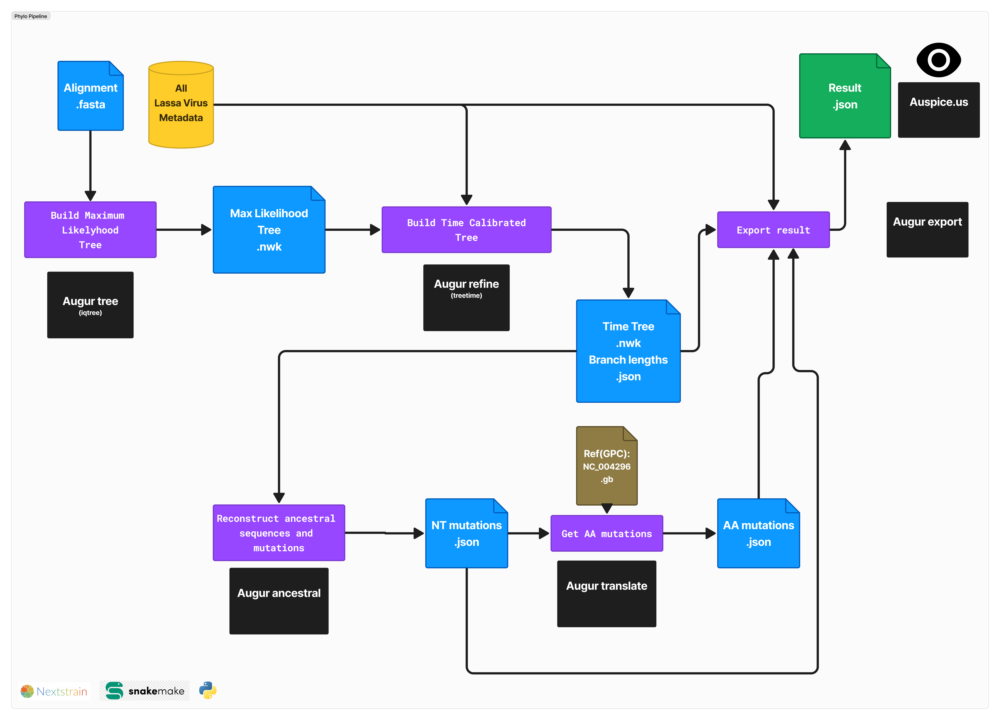

# LASV_Phylogenetics_Pipeline

## Overview
This repository contains the Nextstrain pipeline for phylogenetic analysis of Lassa Virus (LASV GPC) sequences.

## Project Repositories
- **Data and Processing:** [LASV_ML_Manuscript_Data](https://github.com/JoiRichi/LASV_ML_manuscript_data)
- **Lassa Virus Phylogenetics:** [LASV_Phylogenetics_Pipeline](https://github.com/JoiRichi/LASV_phylogenetics_pipeline)
- **Lassa Virus Lineage Prediction:** [LASV_Lineage_Prediction](https://github.com/JoiRichi/LASV_lineage_pred)

## Jupyter Notebooks on Google Colab
- **General Preprocessing:** [Notebook Link](https://colab.research.google.com/drive/1JOgS2-dDoQ7OPHPcXm3AIBDnGQAFxIyR)
- **Motif Search Using RF MD Pcorr:** [Notebook Link](https://colab.research.google.com/drive/1M1yYB65MOWUpMYcn24Jfm6jvZZ13QJ6l)
- **Lassa Virus Lineage Prediction Training:** [Notebook Link](https://colab.research.google.com/drive/1G0lEjuvPR07bcb181Rfhm-S0WenMFSmR)

## Phylogenetic Pipeline Overview


## Running the Pipeline
This pipeline relies heavily on Nextstrain. Please install Nextstrain first by following the [installation guide](https://docs.nextstrain.org/projects/cli/en/stable/installation/) and ensure the Nextstrain command is available in your terminal.

Clone this repository using (or simply download it as a zipped file and unzip.):
```sh
git clone https://github.com/JoiRichi/LASV_phylogenetics_pipeline.git
```


Enter the Nextstrain shell in the root directory of the pipeline. Note: you must enter the Nextstrain shell each time you want to use the pipeline.

```sh
nextstrain shell .

```

When the shell is active, run the pipeline using:

```sh

snakemake --cores 5  # you can change the number of cores
# To re-run the pipeline from scratch, use snakemake --cores 5  -F
#please refer to snakemake documentation for help.
```


Upon completion, go to the pipeline 'auspice' folder and view the final JSON file using [Auspice](https://auspice.us/). Drag and drop the file.


## Customization
The pipeline config folder contains the input files for this pipeline. Learn how the data was preprocessed here: [LASV_ML_Manuscript_Data](https://github.com/JoiRichi/LASV_ML_manuscript_data). It is possible to use your own custom sequences using the same process.


For further details, please refer to the respective notebooks and repositories linked above.

Special thanks to the [Nextstrain](https://github.com/nextstrain) main developers for providing backbone open source code for this pipeline and guidance in its modification to work with Lassa Virus.
